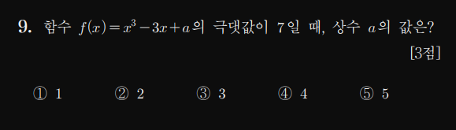

## 알고리즘

### 1. 정의 
* 어떤 문제를 **컴퓨터**로 풀기위해 사용하는 **방법**
  * 어떤 문제? = 수학문제

### 2. 목적
* 문제를 컴퓨터로 풀기 위함
* 정확하고 빠르게 -> **효율적으로 풀기** 위함
* 다양한 문제를 해결하는 방법 = 알고리즘 설계 기법을 공부함


### 3. 우리가 알고있는것
수학문제 푸는거도 알고리즘을 사용한다.

#### 1. 문제를 컴퓨터로 풀기 위함
##### 1-1. 고교시절 어떤 문제와 해답
고교 : 해답 하나를 얻는것이다

```
1. input : x³ - 3x + a, 극대값 = 7
2. output : a
```
*풀이과정*
   1. 함수 미분
      * 3x² - 3 = 3(x -1)(x + 1)
   2. 미분된거 값이 0이되는 미분계수 찾기 
      * x == -1 || 1
   3. 극대인 x 찾기
      * 극대점 == -1
   4. f(극대점) = 7이 되야한다
      * -1 + 3 + a = 7
   5. 해답
      * a = 5

이 과정은 우리 인간 대가리가 해낸거야

##### 1-2. 알고리즘은?
알고리즘 : 

```
1. input : αx³ ± βx² ± γx ± δ, 극대값 = ε
단, -100000000 <= α <= 100000000
단, -100000000 <= β <= 100000000
단, -100000000 <= γ <= 100000000
단, -100000000 <= δ <= 100000000
단, -100000000 <= ε <= 100000000

2. output : α
```
200000001^5 * 2^3 * 5 ...을 풀라고 생각해봐

##### 1-3. 차이점
고교에서 문제를 푼다 : 답을 구해라 
알고리즘에서 문제를 푼다 : (문제 다들어와!! 다) 문제를 푸는 기계를 만들어라


#### 2. 정확하고 빠르게 -> 효율적으로 풀기 위함
##### 1. 수학자 가우스의 일화
사실 문제를 푸는 방법은 여러가지가 있음 너무 당연한 소리인데

학생의 풀이법
```cpp
//준비
int 더하려는숫자[102] = {0, 1, 2, 3, ... ,100 , 101};
int result  = 0;
//풀이시작
for(int i = 0; i < 102; i++){
    result += 더하려는숫자[i];
}
/*
result += 더하려는숫자[0];
result += 더하려는숫자[1];
result += 더하려는숫자[2];
result += 더하려는숫자[3];
result += 더하려는숫자[4];
result += 더하려는숫자[5];
            :
            : 
result += 더하려는숫자[100];
*/

//답
printf(result);
```

가우스의 풀이법
```cpp
//준비
int 더하려는숫자[102] = {0, 1, 2, 3, ... , 100, 101}; 
//이게 등차수열이구나
int result  = 0;

//풀이시작
result = 
    ((더하려는숫자[0] + 더하려는숫자[101]) * (숫자들개수)) / 2;
//답
printf(result);
```

결론 같은 문제라고 다양한 풀이법이고 있는데
그중 우리는 가우스같은 존나 빠른 풀이로 (효율적)인 풀이룰
이용해 푸는것

### 4 정리
알고리즘은 어떤 문제의 모든 입력사례에 대해 해답을 찾아주는 절차다
input에 어떤 입력이 주어져도 해답을 찾을수 있어야함

### 5 대표적인 알고리즘

1. 순차탐색 
```
1. 문제 : 어떤수 x가 n개의 수로 구성된 리스트S에 존재하는가?
2. 해답 : x가 존재하면 x 인덱스가 없다면 -1 해답
3. 패러미터 : 
    n (n > 0)
    S (범위는 1 ~ n)
    x 어떤수
```

[알고리즘_1](./1_개요_코드/1_개요_순차탐색_1.cpp)

2. 이분탐색

```
1. 핸드폰 전화하려고 이름을 찾고 전화하려는데
아니 전화번호부가 이름이 뒤죽박죽이네?? 어찌해야할까요
    해답은 : 다 찾아볼수밖에 없겠지?

2. 근데 사실 핸드폰 전화번호가 정렬된걸 알고있어
그러면 이름을 어떻게 찾을까?
```

```
1. 문제 : 어떤수 x가 n개의 수로 구성된 리스트S에 존재하는가?
2. 해답 : x가 존재하면 x 인덱스가 없다면 -1 해답
3. 패러미터 : 
    n (n > 0)
    S (범위는 1 ~ n) 정렬된 리스트다. 
    x 어떤수
```

### 6. 알고리즘의 분석
효율적이다 
    : 시간관점 : 같은수의 데이터를 주고 더 빠른시간에 해결하면된다.
    공간관점 : 같은 동작을하는데 훨씬더 적은데이터를 사용한다.

1. 결국 최적화를 위해 알고리즘이라는것을 배우는것이다.
    * 닌텐도 게임은 용량이 매우작은데 왜 요즘 게임들이 뭐만하면 1기가 되고 그러는가.
이게 공간복잡도와 관련이 있다.
   * 그리고 존나 좋은 그래픽카드에도 렉이 걸리는게임을 보면 최적화가 병신같다 이러지? 이게 바로 시간복잡도와 관련되어 있음

근데 가끔 인간이 보기에는 이게 가끔 왜 빠른지 모를때도 있다
다음은 삽입정렬과 퀵정렬의 예시다.

| 삽입정렬                                                                           | 퀵정렬                                                                             |
| :--------------------------------------------------------------------------------- | :--------------------------------------------------------------------------------- |
|  |  |

어느게 빠르게 보이나?
당연히 삽입정렬이 빨라 보인다 
퀵정렬? ㅈ랄한다 ㅋㅋㅋ :angry:
: 
: 
:
근데 사실 퀵이 괜히 퀵이 아님
https://www.youtube.com/watch?v=kPRA0W1kECg&t=159s


그래서 수학적 증명을 통해 누가 더 빠른지 알수있다.