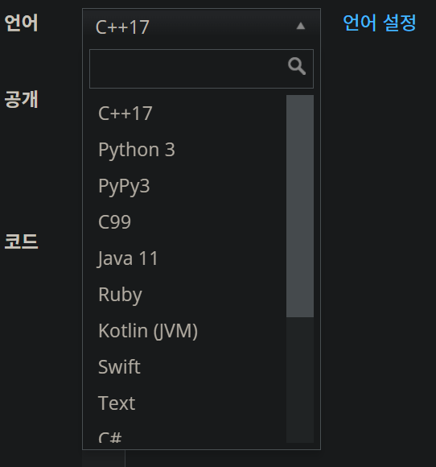

### 1. 백준이란

국내 최고 문제 해결 사이트
https://www.acmicpc.net/
> 백준?? 백준이 어떻게 사이트 이름이노 ㅋㅋㅋ


다양한 언어로 제출할수 있다.


### 2. 우리는 무슨 언어로 할것인가


```
왜좋냐??
Cpp - 1~3초
Python - 5~15초
... 그러하다 내가 잘하는것도 cpp 이기에..
```

### 3. 한번 제출해보자
[백준 1000번 A+B ](https://www.acmicpc.net/problem/1000)

#### 사전에 알아야할 지식
**1. 백준의 입력 다음은 동일한것이다.**

| 입력 예제 1 | 입력 예제 2 |
| :---------- | :---------- |
| 1 2         | 1<br>2      |

**2. 출력또한 동일한것이다.**

**3. 변수는 바깥에 선언해줘라..**
다음 두 코드를 실행해보자
[1. 천만배열밖](./2_백준의규칙/천만배열밖.cpp)
[2. 천만배열안](./2_백준의규칙/천만배열안.cpp)


### 4. 우린 근데 CPP을 사용하쟤매?
[앞으로 모르는 문법은 여기서..](https://www.cplusplus.com/reference/)
```cpp
#include <iostream>
#include <vector>
#include <algorithm>
#include <string>

using namespace std;
```
이것들을 배워보고 한번 다시 A + B. 해보자

#### [1. cin? cout?](https://blockdmask.tistory.com/475)
```
장점 
    자료형? 맡겨만 달라구
        %d 자료형을 적어주지 않아도 사용가능
        cin >>
        cout << '\n';

물론 장점만 있는게 아니다
    1. 느리다..
    2. 다양성이 부족해짐 
        123456
        cin으로 받으면 "123456"
        scanf로 받으면 1, 2, 3, 4, 5, 6 
```
#### [2. vector란?](https://blockdmask.tistory.com/70)
```
문제는 배열 크기가 1이였다 100이였다 
N로 제멋대로 패러미터가 변경된다.
그렇다면 우리는 이렇게 변동하는 데이터에 대해서 어떻게 처리할까?

1. 가장 미친방법
    arr = malloc(sizeof(자료형) * N)

2. 난 부자야!!!! 이것도 많이 사용한다.
    arr[9999999999999999999999999] = {0,}
    단점 : 아니.. 계산기 용량이 왜 10기가지??

3. vector을 사용한다
    장점 : 
        1. 좆같은 malloc 안써도 된다.
            c : arr[N] = value;
            cpp : V.push_back(value);
        2. 배열의 크기를 역으로 알아낼 수 있다
            V.size()
    사용법 : 
        그럼 어떻게 선언하나?
            vector<자료형> V;
        이차원 배열은 어찌하나?
            vector<자료형> V[999999999] =
        값은 어떻게 넣나?
            V.push_back(value);
        값은 어떻게 접근하나?
            V[1]; V[2]; ...
        값은 어떻게 삭제하나?
```

#### 자 그럼 다시 한번 풀어보자
[백준 2750번 수 정렬](https://www.acmicpc.net/problem/2750)

호오... 버티는군? 이건 어떄?
[백준 2751번 수 정렬](https://www.acmicpc.net/problem/2751)

#### [3. algorithm](./2_백준의규칙/알고리즘헤더.html)
