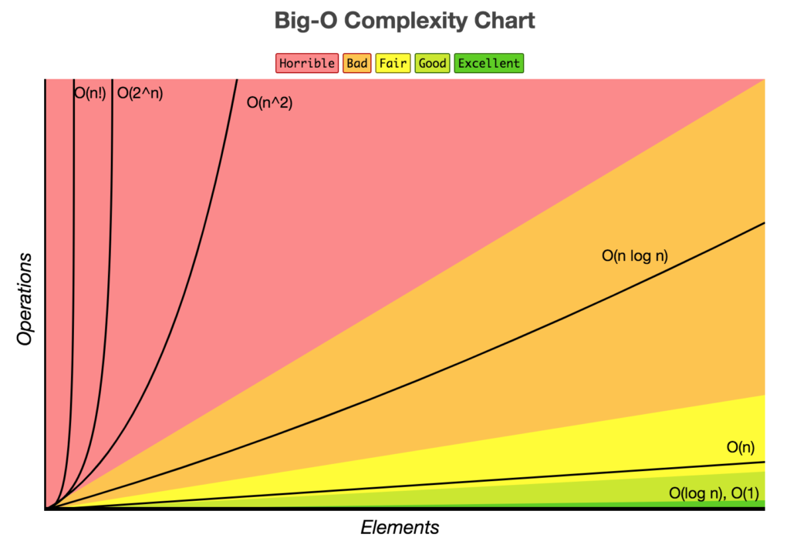
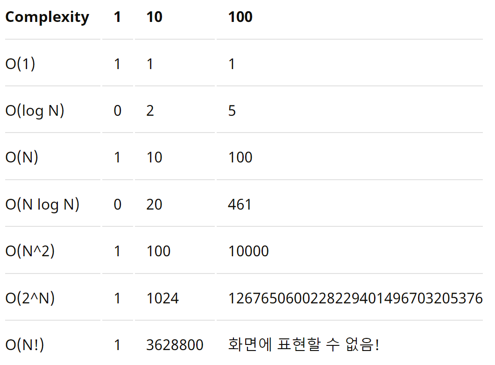
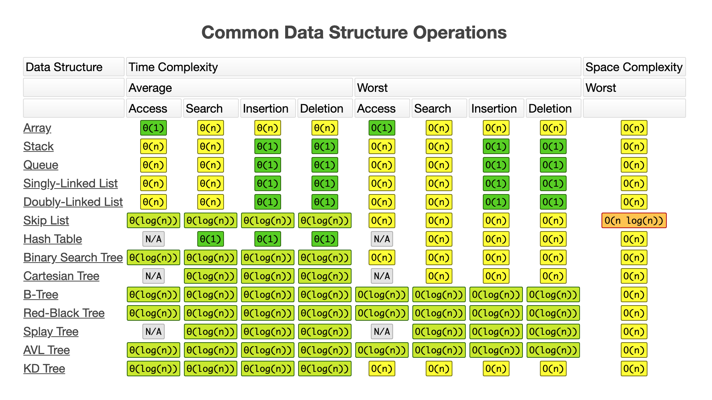

```
시간복잡도의 개념이 
왜 필요한지 다시금 설명해야겠다.

알고리즘은 매우 많다 그리고 
알고리즘마다 데이터 양에 따라 속도가 다를것이다. 
혹은 같은 동작임에도 어떤건 빠르고 어떤건 느리다.
심지어 어떤 동작에 대한 속도의 척도가 되기도한다.

다음 알고리즘이나 자료구조를 들어봤나? 몰라도 괜찮다.
이진탐색,
아리스토테네스의 체(소수구하기),
GCD 최대공약수, LCM 최소공배수 유클리드 호제법,
버블정렬, 삽입정렬, 선택정렬, 퀵정렬, 합병정렬

연결리스트의 삽입 삭제
배열의 삽입 삭제
트리의 탐색

문제를 주겠다
1. 이진탐색의 탐색 속도는?
    최선은? 최악은? 평균은?
2. 버블정렬의 탐색 속도는? 삽입정렬의 탐색 속도는?
    최선은? 최악은? 평균은?
3. 메모리 낭비없는 배열의 삽입은? 삭제는? 접근은?
4. 연결리스트의 삽입은? 삭제는? 접근은?
5. 트리의 탐색 접근은?

역시 쉽게 답하기는 어려울것이라 생각한다
별로 알려줄게 없다

10개 들어올때 코드를 몇줄 실행하는지 생각하면 되는것이다.
100개 들어올때 코드를 몇줄 실행하는지 생각하면 되는것이다.
: 
: 
와 같이 N개 들어올떄 코드를 몇줄 실행하는지 생각하면 되는것이다

... 너무 돌려 말했지?
정확히 N개 들어올때 몇줄실행될지 일반화를 하자
그렇다면 어떤 함수가 나오겠지?

즉 시간복잡도를 표기하는 방법에 대해 이제 얘기할것인데
시간 복잡도는 함수로 표현하면 된다.

몇초가 실행되요.. 
이런게 아니라 코드 뭉탱이가 얼마나 많이 실행되는가를 알면 되는것이다.

자료의 크기가 크면 클수록 더 많이 실행되는 상황은
머리속에 떠오르는그게 바로 정답일것이다.

바로 반복문이다. 반복문이 시간복잡도를 지배한다!
```
다음과 같은 예시가 있다.

자동차 두대가 있고 서울에서 부산까지 가야하는데
어느걸 타고가야 더 빨리 도착할수 있는지?
| 항목                         | 자동차 A | 자동차 B |
| :--------------------------- | :------- | :------- |
| 시동거는데 걸리는시간        | 3분      | 5초      |
| 문 열었다 닫는 시간          | 1분      | 0        |
| 등받이 조절하는데 걸리는시간 | 5분      | 0        |
| 유리 닦는데 걸리는시간       | 4분      | 0        |
| 최대 시속                    | 200km/h  | 40km/h   |
```
... 사실 자동차 B는 자전거다 ㅋㅋㅋㅋㅋ
자전거는 문도 없고 등받이도 없고 유리 닦을 필요도 없다
시동이라곤 그냥 앉고 패달 밟으면 바로 간다고 치면 5초라고 할수있겠지

근데.. 서울에서 부산까지 빨리 가는데 자동차 대신
자전거를 타겠냐? ㅋㅋㅋㅋㅋㅋㅋㅋ 엄복동와도 무리다 ㅋㅋㅋㅋ

이렇게 전체 대소를 좌지우지하는 것을 지배한다고 표현한다.

알고리즘에서는 전체 대소를 지배하는것이 방금 반복문이라고 했다.
```





비율을 확인해보자 계란으로 바위치기를 생각하면된다.
시간복잡도가 높다는 말은 입력 크기가 증가할때 알고리즘 수행시간은
더 빠르게 증가한다는 의미다.


### 다음이 바로 코드 한줄 실행이다.
1. 변수 선언
2. 사칙연산 뭉텡이
3. 인풋 아웃풋
4. 대소비교
```cpp
function O_1_algorithm(arr, index) {
  return arr[index];
}

let arr = [1, 2, 3, 4, 5];
let index = 1;
let result = O_1_algorithm(arr, index);
printf(result); // 2
```

### 다음이 바로 C*N 코드이다
1. 반복문
```cpp
while(N--){printf("")}
for (int i = 0; i < n; i++) {
    int temp;
    cin >> temp;
    arr[i] = temp;
}

```

### 다음이 바로 log코드이다.
1. 이진탐색 (반띵)
```
1~100 중 하나의 숫자를 플레이어1이 고른다. (30을 골랐다고 가정한다.)
50(가운데) 숫자를 제시하면 50보다 작으므로 down을 외친다.
1~50중의 하나의 숫자이므로 또다시 경우의 수를 절반으로 줄이기 위해 25를 제시한다.
25보다 크므로 up을 외친다.
경우의 수를 계속 절반으로 줄여나가며 정답을 찾는다.
```

### 다음이 바로 N의 제곱들이다.
1. 다중 반복문
```
function O_quadratic_algorithm(n) {
  for (let i = 0; i < n; i++) {
    for (let j = 0; j < n; j++) {
      // do something for 1 second
    }
  }
}

function another_O_quadratic_algorithm(n) {
  for (let i = 0; i < n; i++) {
    for (let j = 0; j < n; j++) {
      for (let k = 0; k < n; k++) {
        // do something for 1 second
      }
    }
  }
}
```

```
---그러면 코드를 보고 한번 예측해보자---
질문할때 10개일때는? 1000개일때는? 이렇게 질문해보자

왜냐하면 언어마다 제각기 같은 코드라고 해도 속도가다르기 때문이다
C 같은경우 1초에 1억 
Python 1초에 2000만 

OK.. 알겠어 근데 매 알고리즘 배울때 마다 다항식으로 표현되는
함수를 보자하니.. 약간 복잡해

3n+1, 10n, 4n² + 10n, logn, nlogn.. 
다항식으로만 표기해서 생기는 단점
1. 정확하지만 좀 읽기 짜증난다.
2. 어차핀 일정 크기 이상으로 들어오면 거기서 거기다..

그래서 수학자들은 다음과 같은것으로 깔끔하게 정리했어
다항식에서 가장 큰 영향을 주는 부분만 잘라서 사용하기르
3n+1 -> n
10n -> n
4n² + 10n -> n²

이거를 뭐라고 하냐면 점근적 분석이라고 해
이때 중요하지 않는 상수와 계수들을 제거하면 
알고리즘의 실행시간에서 중요한 성장률에 집중할 수있는데 이것을 점금적 표기법(Asymptotic notation)이라 부른다.

O(1) – 상수 시간 
    : 문제를 해결하는데 오직 한 단계만 처리함.

O(log n) – 로그 시간 : 
    문제를 해결하는데 필요한 단계들이 연산마다 특정 요인에 의해 줄어듬.

O(n) – 직선적 시간 : 
    문제를 해결하기 위한 단계의 수와 입력값 n이 1:1 관계를 가짐.

O(n log n) : 
    문제를 해결하기 위한 단계의 수가 N*(log₂N) 번만큼의 수행시간을 가진다. (선형로그형)
O(n^2) – 2차 시간 : 
    문제를 해결하기 위한 단계의 수는 입력값 n의 제곱.
O(C^n) – 지수 시간 : 
    문제를 해결하기 위한 단계의 수는 주어진 상수값 C 의 n 제곱.

엥 근데 이 O라는것은 뭐임?
Big-O(빅-오) ⇒ 상한 점근
Big-Ω(빅-오메가) ⇒ 하한 점근
Big-θ(빅-세타) ⇒ 그 둘의 평균

그런데 왜 O를 주로 표기한것이냐?
그건 바로 예전에도 말했지만 

어떤 데이터가 들어와도 풀어낼수 있는 기계를 만들라는것이 바로
알고리즘이라고 했지?

그렇다면 어떤 데이터가 들어와도 특정상황에는 
운안좋게 ㅈㄴ 느리게 된다면 어떻게 될까?

물론 여기서 드는 생각은 어? 평균을 쓰면 좋지 않겠나?

No.. 만약 주식 거래 앱이라고 생각해 웹페이지를 만들때 너무 오래기다리면 연결을 끊는 페이지가 있어 
쳐 평균은 n²/2 이고 최악은 n²이야 평균을 가정하고 
만들었고 실제 n²의 연산을 수행해야하는 상황이 온다고 생각해봐 
이 페이지 실시간으로 주식 거래해야하는데 
갑자기 n²/2시간보다 조금만 넘어도 바로 페이지 연결 끊는다고 
생각해봐ㅋㅋㅋㅋㅋㅋㅋㅋㅋㅋㅋㅋㅋㅋㅋㅋㅋㅋㅋ

그러니깐 최악의 상황이 닥쳐도 돌아가게끔, 
혹여나 이거보다는 느릴수 없다라는 안전벨트가 필요하겠지? 그게 바로 O를 쓰는 이유야

그래서 적어도 이거보단 느리지 않다 즉, 최악의 상황을 고려해서
넓게 넉넉하게 잡아서 표기하려고 한 의도다.


```

그런데 대충 코드보고 판단이 가능한 부분도 있긴하다.


https://hanamon.kr/%EC%95%8C%EA%B3%A0%EB%A6%AC%EC%A6%98-time-complexity-%EC%8B%9C%EA%B0%84-%EB%B3%B5%EC%9E%A1%EB%8F%84/

https://blog.chulgil.me/algorithm/

