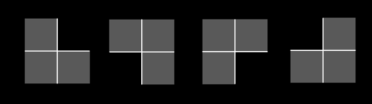
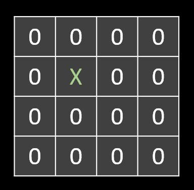
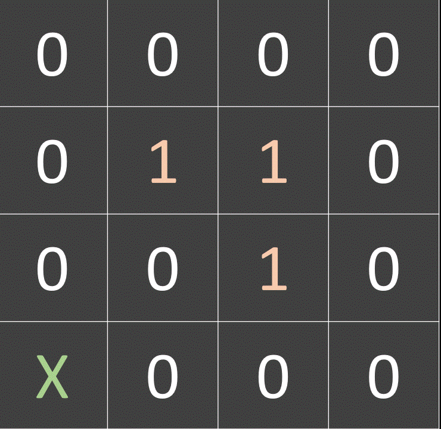
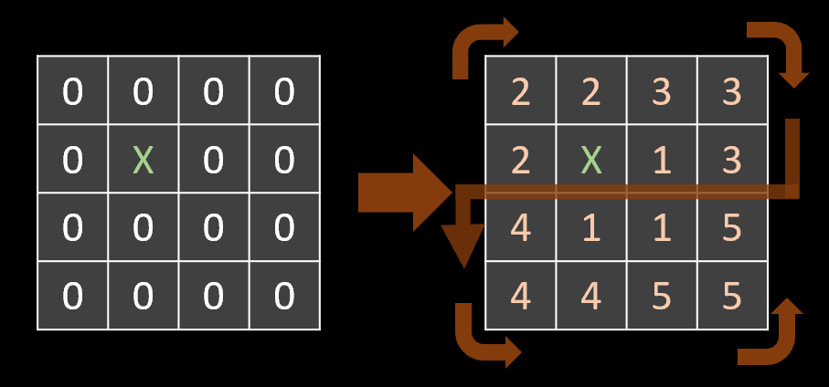
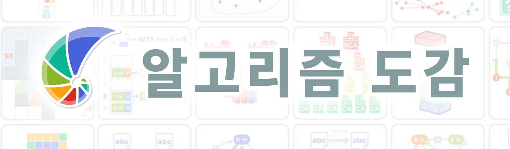

## 1-5 트로미노 퍼즐
### Quest
#### ❗ 용어 정리
##### 👉 트로미노란?
* 정사각형 3개 붙어있는것을 트로미노라고 한다
    

##### 👉 퍼즐의 모양은?
* m*m의 판 (단, m은 2의 거듭제곱)
  * 1칸은 X표기 되어있음
  

##### 👉 알고리즘 조건은?
* 다음 조건을 만족시키면서 트로미노를 채운다
  1. 트로미노는 겹쳐 놓을 수 없다.
  2. 트로미노는 판을 빠져나올 수 없다
  3. 전체를 트로미노로 채워야한다.
  

#### ❗ 입력과 출력
* input 
    : m(보드의 크기) = 4
    row(X위치) = 1 
    col(X위치) = 1

* output 
    : 배열에 트로미노의 번호를 출력
    

#### ❗ ㄴ, ㄱ (숫자가 적힌 트로미노)로 보드를 채우자
##### 👉 트로미노 퍼즐 분할정복

* [Divide] : 사분면으로 분할 X가 없는 사분면 모서리 채우기
* [Conquer] : 채워진 네개의 사분면 호출

[파이썬 코드](./코드/트로미노.py)
[ C++ 코드](./코드/트로미노_백준14601번.cpp)

### 참고

#### 1. 주니온
#### 2. 알고리즘 도감

 
  
   본 글에서 사용하는 GIF는 알고리즘 앱 자동재생

