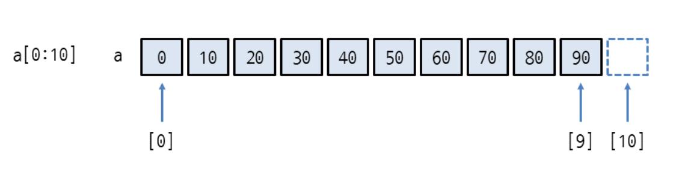

<style>
.imgOption{
    display:flex;
    justify-content:center;
    align-items:center;
    height: 600px; 
}
h2{
    font-weight :bold;
    border : 6px solid #DC143C;
    color : #DC143C !important;
}
h3 {
    font-weight :bold;
    border : 3px solid ;
}
</style>

### 1. list indices must be integers or slices, not float

#### 형변환을 써주지 않는 파이썬은.. 다음과 같은 문제가 있었다
#### C++같은 경우는 
1. int 일때
    * / 연산하면 무조건 몫
    * % 연산하면 무조건 나머지
2. float 이 되어야 / 연산에 소수점이 붙는다

그래서 배열 이분탐색 인덱스 접근할때
```cpp
int mid = (low + high) /2;
arr[mid] == X;
```
다음과 같이 표현 가능했다

#### python 같은 경우는
int(5) / int(2) 경우도 float(2.5f) 과 같은 결과를 내보낸다

그렇다면 CPP 처럼 무조건 몫연산인 역활을 수행할 방법은없나?

```py
A / B #소수점 리턴
A // B #무조건 정수형 몫
A % B #무조건 나머지
```

### 2. 슬라이싱
https://dojang.io/mod/page/view.php?id=2208

슬라이싱을 통해 리스트를 띵띵 컷~ 할수 있다

단, 슬라이싱을 쓸때 END값을 
**우리가 일반적으로 아는 인덱스에 + 1** 더 많이 지정해줘야한다

```py
list1 = S[0 : mid]
list2 = S[mid+1 : N]
```
와 같이 표현 가능하다.

리스트의 합병을 검색하면 도움을 받을수 있을것이다.