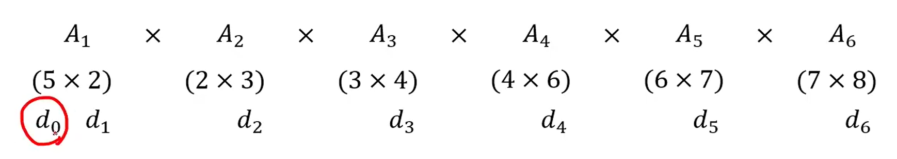
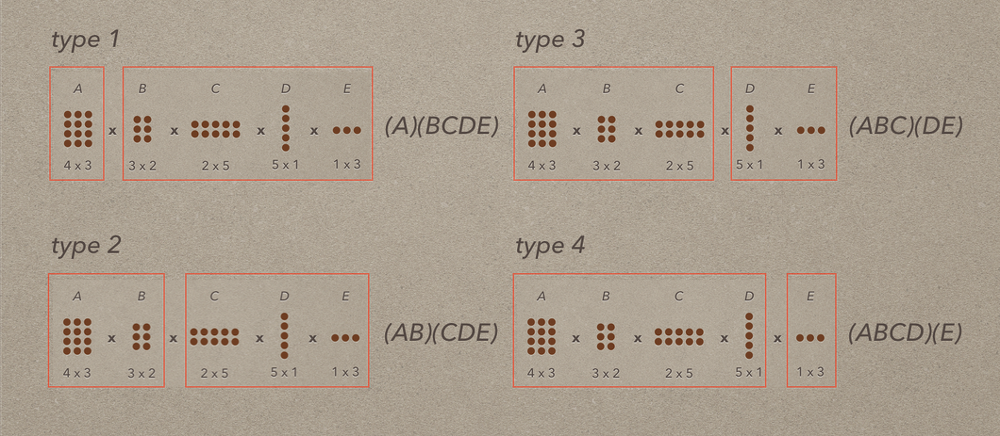

<!-- 
## 1-5 트로미노 퍼즐
### Quest
#### ❗ 용어 정리
##### 👉 트로미노란?

#### ❗ 입력과 출력
* input 
    : m(보드의 크기) = 4
    row(X위치) = 1 
    col(X위치) = 1

* output 
    : 배열에 트로미노의 번호를 출력

#### ❗ ㄴ, ㄱ (숫자가 적힌 트로미노)로 보드를 채우자
##### 👉 트로미노 퍼즐 분할정복

* [Divide] : 사분면으로 분할 X가 없는 사분면 모서리 채우기
* [Conquer] : 채워진 네개의 사분면 호출

[파이썬 코드](./코드/트로미노.py)
[ C++ 코드](./코드/트로미노.cpp)

### 참고

#### 1. 주니온
#### 2. 알고리즘 도감

 
  
   본 글에서 사용하는 GIF는 알고리즘 앱 자동재생

-->

## 연쇄 행렬 곱셈
### Quest
* 행렬 A, B, C, D... 연쇄적인 행렬이 주어질때, 
  어떤 행렬끼리 먼저 곱하는게 연산량이 적어지는가?
* 경우에 따라 10000번 넘는경우도 있고, 1000번이 되는경우가 있다..

#### ❗ 용어 정리
* ##### 👉 행렬곱
  * A(2 x 3) * B(3 x 5) =
    * 원소 곱셈의 횟수 : 2 * 3 * 5
* ##### 👉 엄밀한 정의
  * 
    
    * A₁ x A₂ x A₃ x An
    * A(k-1)의 행 개수 == A(K)의 열 개수를 만족해야함
* ##### 👉 d 리스트
    * 
    * d0 = A1의 열 개수
    * dk-1 = Ak-1의 행개수 혹은 Ak의 열 개수
* ##### 👉 M 행렬
    * 연쇄행렬을 곱하는데 필요한 곱셈의 최소 개수
    * M[ i ] [ j ] = i행렬 부터 j행렬까지의 최소곱
      * (1 <= i <= j <= n) 
    * 갱신법
      1. M[ i ][ i ] = 0 
         * (1 <= i <= j <= n) 
      2. **M[1][K] + M[K+1][6]** + **d0 x dk x d6**
        1. **각 부분헹렬의 곱셈 횟수**
        2. **두 행렬의 곱셈 횟수**
     * diagonal
       * i행렬과 j행렬간 곱이 있을때
         * i부분행렬 j부분행렬을 전부 뒤지는데 사용하는 변수
         * 그중 최적의 diagonal이 K가 되는것이다.
       * (1 <= i <= diagonal <= j)
       * 
       * 
* ##### 👉 P 행렬
    * 재귀적으로 어떤 행렬끼리의 곱셈 우선순위가 있었는지 저장하는 배열
    * 즉 K를 저장한다.

### 참고
#### 1. 주니온
#### 2. 알고리즘 도감
#### 3. 안경잡이 개발자 : 동빈나

 
  
   본 글에서 사용하는 GIF는 알고리즘 앱 자동재생

