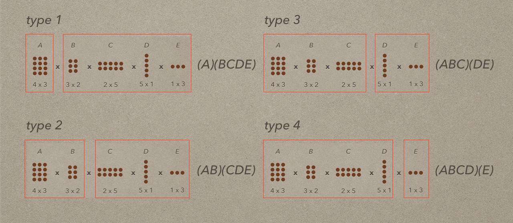
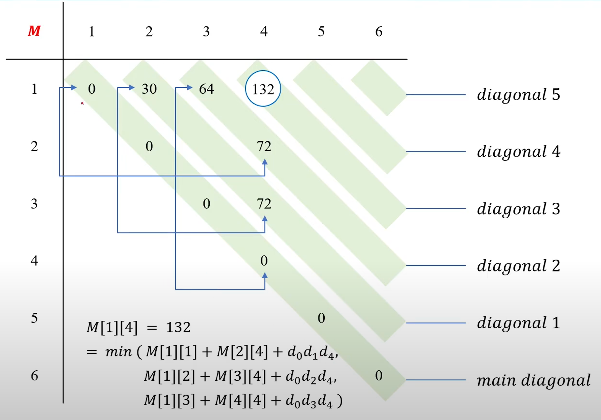
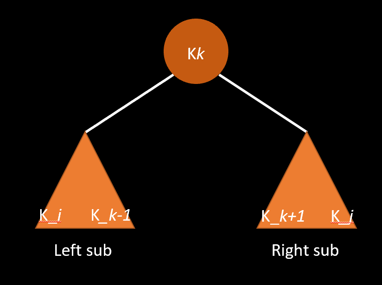

## 연쇄 행렬 곱셈
### Quest
* **주어진 n개의 key로 최적의 이진 검색 트리를 구하라는 것  평균탐색시간 적은것**

#### ❗ 용어 정리
* ##### 👉 이진 검색 트리
  * 이진트리
  * 각 노드는 유일한 키를 가지고 있다
  * 
<!--
* ##### 👉 M 행렬
    * 연쇄행렬을 곱하는데 필요한 곱셈의 최소 개수
    * M[ i ] [ j ] = i행렬 부터 j행렬까지의 최소곱
      * (1 <= i <= j <= n) 
    * 갱신법
      1. M[ i ][ i ] = 0 
         * (1 <= i <= j <= n) 
      2. **M[1][K] + M[K+1][6]** + **d0 x dk x d6**
        1. **각 부분헹렬의 곱셈 횟수**
        2. **두 행렬의 곱셈 횟수**
     * diagonal
       * i행렬과 j행렬간 곱이 있을때
         * i부분행렬 j부분행렬을 전부 뒤지는데 사용하는 변수
         * 그중 최적의 diagonal이 K가 되는것이다.
       * (1 <= i <= diagonal <= j)
       * 
       * 
-->

* ##### 👉 A 행렬
  1. **단계**
     * 이진 검색트리를 만드는데 최적 검색 비용의 행렬
        A[ i ][ j ] : K*i* 에서 K*j* 까지 이진검색 트리를 만드는데 최적 검색 비용
     * ( K_*i* ~ K_*k-1* )( K_*k* )( K_*k+1* ~ K_*j* )로 분할하는 재귀관계식 찾기
       * 
       * 3등분을 분할한다는점에서 좀 특이하긴하다. 
  2. **단계** 
     * 초기화 
       * A[ i ][ i ] = p_*i*
         * A[i][i-1] = 0
         * A[j+1][j] = 0
     * 최종목표
       * A[ 1 ][ n ]
     * 상향식 계산 : diagonal
       * 대각선 1, 2, 3 ... n - 1번.
  3. 갱신법
     A[ i ][ j ] = minimum(A[ i ][ k-1 ] + A[ k+1 ][ j ] + rep(m , i, j+1) P_*m* ) 

#### ❗ 입력과 출력
* input 
    : N : 노드의 수
    K : n번째 노드의 key 리스트
    P : n번째 key 노드의 검색확률
    *c* : n번째 K가들어간 순서 리스트 

* output 
    : D = 플루이드 워셜 전체 정점 행렬

### 참고
#### 1. 주니온
#### 2. 알고리즘 도감
#### 3. 안경잡이 개발자 : 동빈나

 
  
   본 글에서 사용하는 GIF는 알고리즘 앱 자동재생

